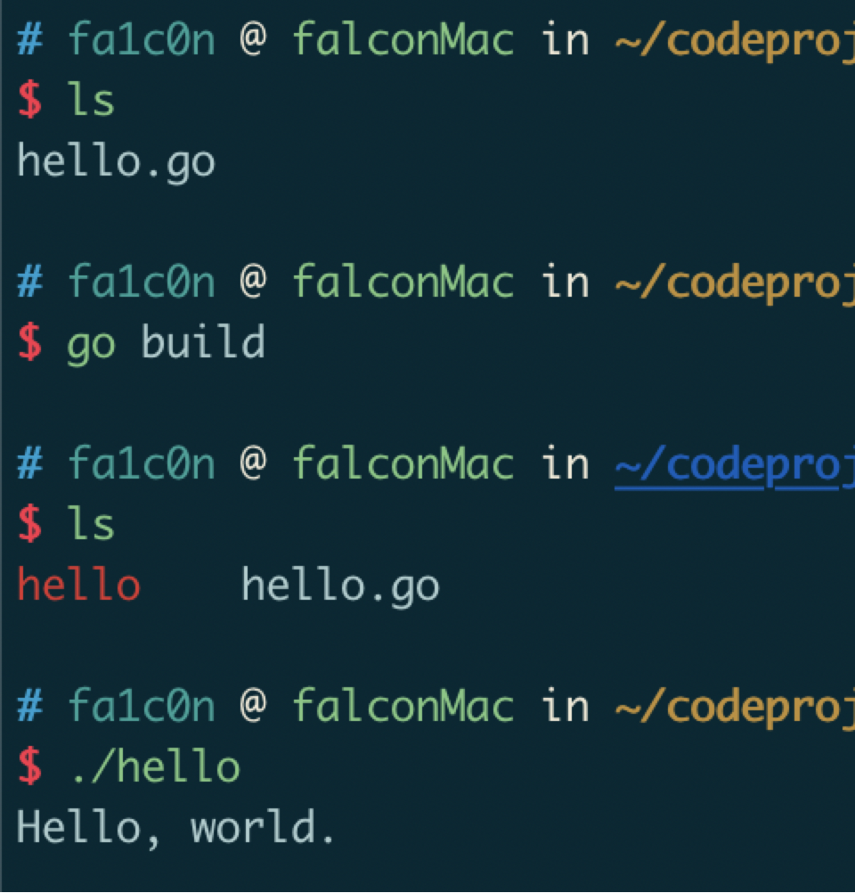

## 一、go项目工程结构

配置好工作目录后，就可以进行编码开发了。在这之前，我们看下go的通用项目结构，这里的结构主要是源代码相应的资源文件存放目录结构。

### 1.1 GOPATH目录


`GOPATH`目录就是存放我们所编写的源代码的目录，该目录下往往要有3个子目录：`src`、`bin`、`pkg`。

- src ---- 里面的每个子目录，就是一个包，包内是go的源码文件
- pkg ---- 编译后生成的，包的目标文件
- bin ---- 生成的可执行文件

### 1.2 编写第一个程序

在`$GOPATH/src`目录下，再新建一个目录`hello`，在该目录下创建`hello.go`文件，代码如下：

```go
package main

import "fmt"

func main() {
    fmt.Println("Hello, world.");
}
```

执行go程序，有以下几种方式:
- 方式一：使用`go run`命令


- 方式二：使用`go build`命令


- 方式三：
在任意目录下，执行`go install hello`，或在`hello`目录下执行`go install`，会在`GOBIN`目录下生成对应的可执行文件。


>注意：
>在编译生成go程序时，go实际上会去两个地方去找程序包：
>(1) `GOROOT`下的`src`目录
>(2) `GOPATH`下的`src`目录
>
>在程序包里，自动找`main`包的`main`函数作为程序入口，然后进行编译.

### 1.3 第一个程序的解释说明

##### package

- 在同一个包下面的文件属于同一个工程文件，不用`import`包，可以直接使用
- 在同一个包下面的所有文件的`package`名，都是一样的

##### import

`import fmt`告诉Go编译器这个程序需要使用`fmt`包的函数，`fmt`包实现了格式化IO(输入/输出) 的函数。
`import`后面，可以是相对路径，也可以是绝对路径。推荐使用绝对路径(起始于工程根目录)。

- 1、点操作

我们有时候会看到如下方式的导入包:

```go
import(
  . "fmt"
)
```

这个点操作的含义就是这个包导入之后，在你调用这个包的函数时，你可以省略前缀的包名，比如 `fmt.Println('hello')`，可写成 `Println('hello')`

- 2、别名操作

顾名思义，就是可以把包名用另一个较容易记忆的名字代替。

```go
import(
  f "fmt"
)
```

使用的时候，比如：`f.Println('hello')`

- 3、`_`操作

请看下面的 `import`

```go
import(
  "database/sql"
  _ "github.com/ziutek/mymysql/godrv"
```

`_`操作是其实是引入该包，而不直接使用包里面的函数，而是调用了该包里面的`init`函数。

##### main

`main()`是程序运行的入口。


### 1.4 包的说明

我们知道源代码都是存放在`GOPATH`的`src`目录下，如果有多个项目的时候，怎么区分呢？答案是通过包，使用包来组织我们的项目目录结构。包如果以域名开头就不会有重复，比如百度的网站是 `https://www.baidu.com`，则可以以`baidu.com`的名字创建一个目录。

如果有自己的域名，也可以使用自己的域名。如果没有个人域名，现在流行的做法是使用你个人的github名，因为每个人是唯一的，所以不会有重复。


如上，`src`目录下跟着一个个域名命名的文件夹，再以`github.com`为例，它里面又是以github用户名命名的文件夹，用于存储属于这个github用户编写go代码。

